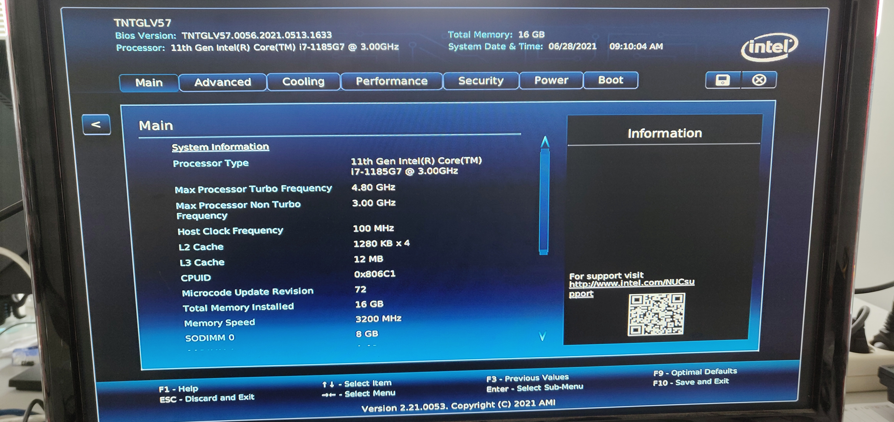
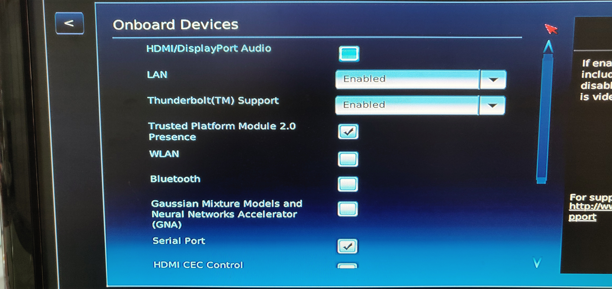

# BIOS Update for NUC
(Instructions taken from https://www.intel.com/content/www/us/en/support/articles/000033291/intel-nuc.html)

- Download the *.cap file for the Intel BIOS version (see table below) from https://downloadcenter.intel.com/search?keyword=bios+aptio (choose filter as shown below).

- Place it at the root folder of an usb stick.

- Plug the usb stick into the NUC and startup the NUC. Press F7 to enter the BIOS updater.

- Select the usb stick in the menu and select the *.cap file.

- Wait for the setup to finish.

## Shipped BIOS Versions of NUC Generations

| NUC Generation    | BIOS Version |
| --------------    | ------------ |
| 11                | TNTGLV57.0056.2021.0513 |
| 10                | FNCML357.0053.2021.0904 |
| 7                 | BNKBL357 |

# BIOS settings for NUC 11 and 10

Startup PC and Press (and hold) **F2** to enter BIOS (press **F10** to enter Boot Menu)

## Main

## Advanced 
Click on `Onboard Devices`

- disable `Onboard Devices` except `LAN` as shown in the pictures

## Cooling 
- select `Cool`

## Performance 
- **for NUC 11**: nothing to be done
- **for NUC 10**: go to `PROCESSOR` and disable `Intel Turbo Boost Technology`

## Security 
- nothing to be done

## Power 
- modify `Secondary Power Settings` as shown

## Boot 

- click on `Boot Priority`
- modify boot priority check boxes according to the images below

Finally, `Save and Exit` in the upper right corner

# BIOS settings for NUC 7 (old NUC Gen)

Startup PC and Press **F2** to enter BIOS (press **F10** to enter Boot Menu)

Click on `Advanced`

## Main
- nothing to be done

## Devices 
- disable `Onboard Devices` except `LAN` (keep `WLAN` for head when using new router only!) 
- disable `Enhanced Consumer IR` and `HDMI CEC Control` in `Legacy Device Config`

## Cooling 
- select `Cool`

## Performance 
- nothing to be done

## Security 
- nothing to be done

## Power 
- modify `Secondary Power Settings` as shown

## Boot 
- nothing to be done

Finally `Save and Exit` by pressing **F10**
