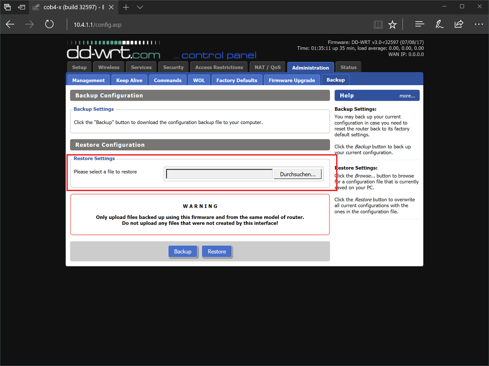

# Setup ddwrt on Linksys WRT 3200

### 1. Prepare Router <a id="Prepare"/>
- Connect Ethernetcable with PC and Router
- Connect Powercable with Router

### 2. Flash DDWRT <a id="Flash"/>
- Download ddwrt image for wrt3200:  
  http://download1.dd-wrt.com/dd-wrtv2/downloads/betas/2017/07-08-2017-r32597/linksys-wrt3200acm/factory-to-ddwrt.bin
- Open Browser and enter Address `192.168.1.1`. You should now see a LinkSys Smart Wifi Setup Screen.
- Accept Lizenz and click on `manual Configuration`.

  
- Now click on `Anmelden` and ether the default Passwort: admin

- You should now see the Linksys web admin page:
- Go to `Konnektivität`, click on `Datei auswählen` on the manual firmware update setting and select the in step 1 downloaded `factory-to-ddwrt.bin`

- Press `start` to start the flash progress  
  Accept the upcomming warings and restart the Router once the process is finished
  
### 3. Generate DDWRT config for Robot <a id="ConfigGen"/>
- clone setup_cob4 repo:  
  `git clone https://github.com/ipa320/setup_cob4`
- cd to script folder:  
  `cd setup_cob4/scripts`
- execute script to generate a ddwrt config
  - `./create_ddwrt_script.sh`
  - enter all required values and double check them (if you are unshure how to get the VPN Certificates look at the [README_Openvpn](README_Openvpn.md)
  - the generated config can be found under `setup_cob4/ddwrt_backup/ROBOTNAME_wrt3200_config.bin`
 
### 4. Setup DDWRT <a id="DDWRT"/>
- After the Router restartet got to the Address `192.168.1.1` by entering it in the Address Bar of you web browser
- Now enter a new username and password  
  user: admin
  password: root
- You should now see the ddwrt admin web page

- Go to Administration -> Backup  
  Select the in Step 3 generated config file and click `Restore`.
  

- Now reboot the Router.
