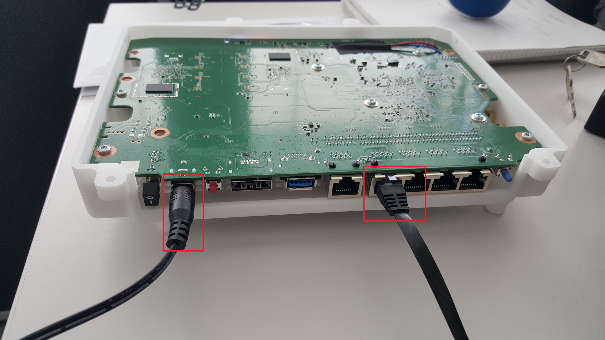
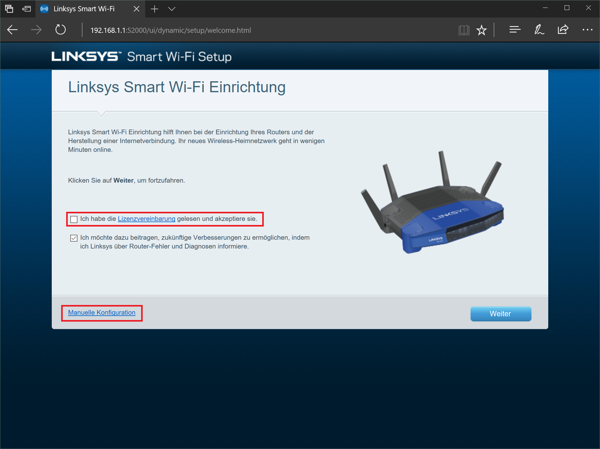
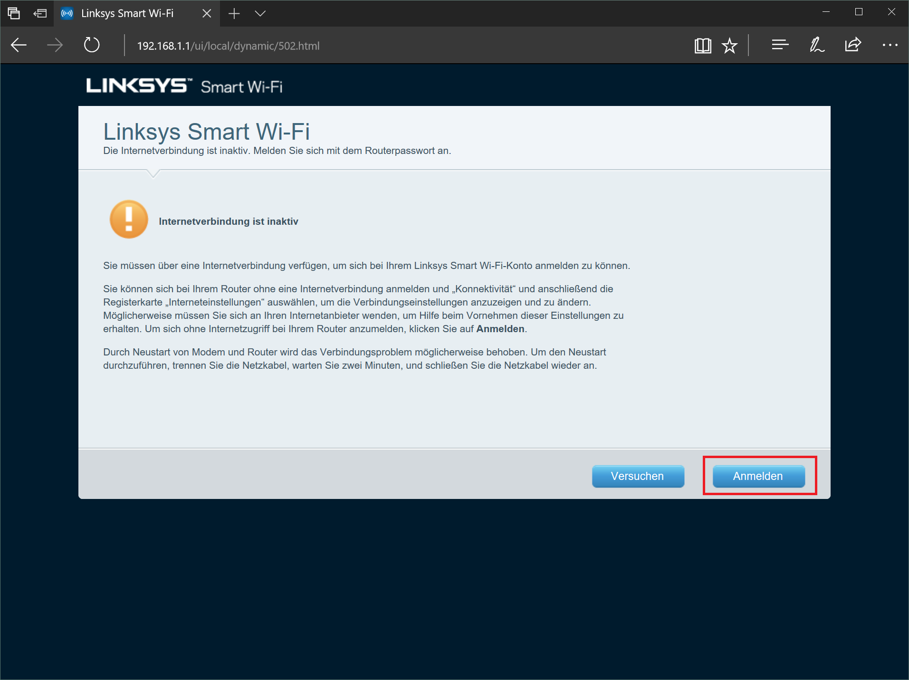
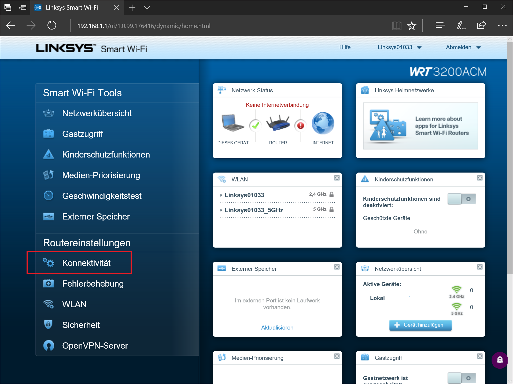
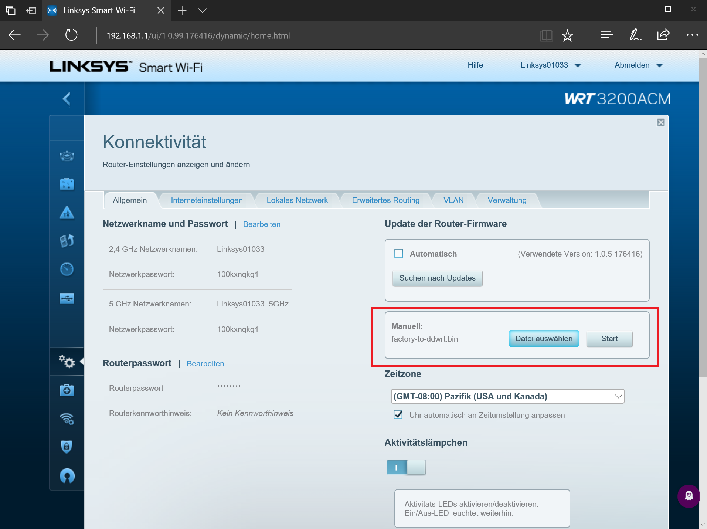
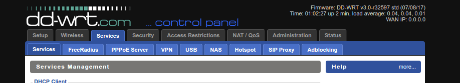
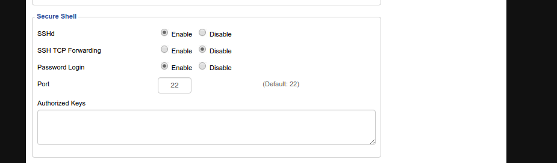

# Setup ddwrt on Linksys WRT 3200

### 1. Prepare Router <a id="Prepare"/>
- Connect Ethernetcable with PC and Router
- Connect Powercable with Router



### 2. Flash DDWRT <a id="Flash"/>
- Download ddwrt image for wrt3200: <br>
  http://download1.dd-wrt.com/dd-wrtv2/downloads/betas/2017/07-08-2017-r32597/linksys-wrt3200acm/factory-to-ddwrt.bin
- Open Browser and enter Address `192.168.1.1`. You should now see a LinkSys Smart Wifi Setup Screen.
- Accept Lizenz and click on `manual Configuration`.



- Now click on `Anmelden` and ether the default Passwort: admin



- You should now see the Linksys web admin page:
- Go to `Konnektivität`, click on `Datei auswählen` on the manual firmware update setting and select the in step 1 downloaded `factory-to-ddwrt.bin`




- Press `start` to start the flash progress <br>
  Accept the upcomming warings and restart the Router once the process is finished

### 3. Setup DDWRT <a id="DDWRT"/>
- After the Router restartet got to the Address `192.168.1.1` by entering it in the Address Bar of you web browser
- Now enter a new username and password <br>
  user: root <br>
  password: admin
- You should now see the ddwrt admin web page


- Go to Services -> Services and active SSHd Deamon

<br>
<br>

### 4. Configure DDWRT for Robot <a id="ConfigGen"/>
- install sshpass on your pc <br>
  `sudo apt-get update`
  `sudo apt-get install sshpass`
- clone setup_cob4 repo: <br>
  `git clone https://github.com/ipa320/setup_cob4`
- cd to script folder: <br>
  `cd setup_cob4/scripts`
- execute script to generate a ddwrt config <br>
  - `./create_ddwrt_script.sh` <br>
  - enter all required values and double check them (if you are unshure how to get the VPN Certificates look at the [README_Openvpn](README_Openvpn.md)

### 5. (Optional) turn off direct wifi
Go to `Administration/commands` and save
```
ifconfig ath0 down
ifconfig ath1 down
```
and save as `Save Startup`.

### 6. Static Leases on Services Page
Go to `Services/Services` and edit MAC Addresses of the PCs

Find out MAC-Adresses of the PCs
```
sudo nmap -sP 10.4.x.0/24 | awk '/Nmap scan report for/{printf $5;}/MAC Address:/{print " => "$3;}' | sort
```
